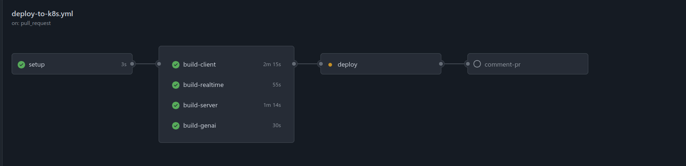
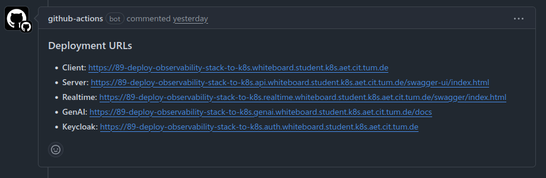

# CI/CD Workflow

This directory contains all GitHub Actions workflow files for automated continuous integration, deployment, and quality assurance of the project.

## Directory Structure

```
.github/workflows
├── README.md                # This documentation file
├── client-linters.yml       # Linting and formatting checks for client code (JavaScript/TypeScript)
├── deploy-to-ec2.yml        # Deploys the application stack to an AWS EC2 VM using Docker Compose
├── deploy-to-k8s.yml        # Full Kubernetes deployment workflow with automatic Docker build & push
├── genai-linters.yml        # Linting & formatting for the GenAI Python service
├── genai-tests.yml          # Runs unit and integration tests for the GenAI service
├── realtime-tests.yml       # Runs Go tests for the Realtime service
├── server-linters.yml       # Linting and formatting for the backend server (Java/Spring)
└── server-tests.yml         # Runs tests for the backend server
```

## Workflow Files Description

- **client-linters.yml**  
  Runs various linting, formatting, and type-checking tools (`ESLint`, `Prettier`, and `TypeScript`) for the `client/` (frontend) codebase on relevant pull requests and workflow_dispatch.

- **deploy-to-ec2.yml**  
  Manually triggered action that deploys the application to an AWS EC2 virtual machine. Uses SCP and SSH actions to upload Docker Compose files and execute deployment on the VM.

- **deploy-to-k8s.yml**  
  Complete pipeline for CI and automated deployment on Kubernetes.  
  - **Triggers:** Push to `main`/`develop`, or pull request to `develop`
  - **Actions:**  
    - Checks out code  
    - Builds and pushes Docker images (client, server, genai, realtime) to GitHub Container Registry  
    - Deploys the new images using Helm with environment-specific values  
    - Outputs deployment URLs and posts them as PR comments.

- **genai-linters.yml**  
  Python-specific code linting and formatting for the `genai/` service using `ruff` (with both check and auto-fix capabilities).

- **genai-tests.yml**  
  Runs automated tests for the `genai/` (Python) service on PRs and manual triggers, using `pytest`.

- **realtime-tests.yml**  
  Executes Go tests for the `realtime/` go service when changes are made or when manually triggered.

- **server-linters.yml**  
  Linting and formatting checks for the backend server using `gradle spotlessCheck`, ensuring code quality before merging.

- **server-tests.yml**  
  Runs backend (Java/Spring Boot) tests automatically for all changes to the `server/` codebase.


## `deploy-to-k8s.yml` — Kubernetes Deployment Pipeline

This workflow handles **automated CI/CD deployment** to Kubernetes for every push to `main`, `develop`, and for PRs to `develop`. It is the main workflow ensuring that all core services are always built, published, and deployed in a uniform, automated way.

#### Workflow Steps Overview

The pipeline consists of the following core stages:

1. **Setup**  
   Determines the branch and deployment environment, sets up variables (e.g., image tags, URLs), and, for PRs, ensures the PR branch is up-to-date with the base branch.

2. **Parallel Build Jobs**
    - **build-client:** Build and push the client (frontend) Docker image.
    - **build-server:** Build and push the backend server Docker image.
    - **build-genai:** Build and push the GenAI (Python) Docker image.
    - **build-realtime:** Build and push the Realtime (Go) Docker image.


   These four jobs run **in parallel** for maximum speed, as visualized below:

   
   

   *(These screenshots are from one of our PRs)*

3. **Deploy**  
   Once all build jobs succeed, the deployment job takes over. It:
    - Determines the appropriate Kubernetes namespace, release name, and Helm values file (production, staging, or PR-specific).
    - Authenticates using secrets.
    - Runs a Helm upgrade/install so that the newly built images are rolled out to the right environment cluster using K8s best practices.

4. **Comment PR**  
   For PRs, the workflow posts a comment on the pull request with all relevant deployment URLs (client, server swagger, real-time swagger, GenAI docs, Auth/Keycloak), making it easy for reviewers to access and verify deployments directly.

#### Key Features

- **Multi-service:** Handles building and pushing all main services in parallel (client, server, genai, realtime).
- **Dynamic Environments:** Deploys to `production`, `staging`, or per-PR namespaces based on branch.
- **Branch Safety:** PRs get their own unique namespace and resource set, keeping environments isolated.
- **Secrets Handling:** Leverages GitHub Secrets for Kubernetes credentials, API keys, and sensitive data.
- **Automated PR Feedback:** Deploys post directly to the PR for instant reviewer access to live endpoints.


## Additional Information

- Use `workflow_dispatch` to manually trigger deployments when needed.
- Deployment URLs are posted automatically on PRs for fast access and testing.
- Sensitive information is managed securely through [GitHub Actions Secrets](https://docs.github.com/en/actions/security-guides/encrypted-secrets).


---

**For more information or customizations, please refer to the individual `.yml` files in this folder.**
