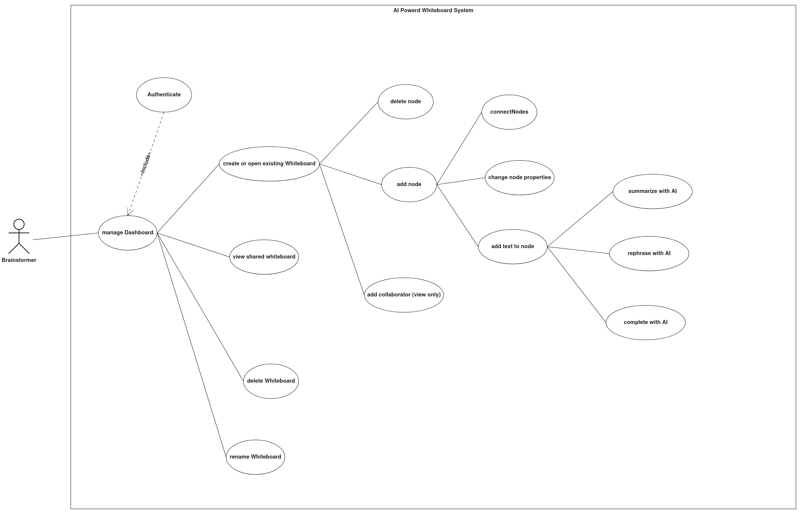

# ✏️ AI-Powered Whiteboard

# Problem Statement
## 🧩 Main Functionality

An AI enhanced digital whiteboard web-application that helps users visualize, organize, and share their ideas.
It addresses the need for a flexible, collaborative space where users can visually organize, express, and share their ideas digitally. It serves as a tool for brainstorming, planning, teaching, and communicating ideas using visual and text-based tools.

---

## 🚀 Main Features

-  **Visual Whiteboard**: Add and arrange text, shapes, and colors to    visualise ideas.
-  **Real-Time Collaboration**: Share boards with others in real time.
-  **Generative AI Integration**:
    - **Text Autocompletion**: AI text-autocompletion.
    - **Text Summarization**: Summarize the text of the User.
    - **Text Enhancement**: Rewrite paragraphs with the help of AI.
---

## 👥 Intended Users

- Students and educators creating mind maps or lesson materials
- Teams collaborating on product ideas, diagrams, and planning
- Individuals who want to sketch out concepts or ideas

---

## 💡 Example Use Cases

- A student builds a study guide with concept branches and uses AI to autocomplete summaries or visualize key ideas.
- A product team drafts a user flow, enhanced with images generated from task descriptions.
- An educator prepares a digital lesson board with the help of AI-generated visuals.
- An educator can collaborate with students, allowing them to view the whiteboard in real time while the educator shares it.

---

## Initial Product Backlog Item

1. As a user, I want to sketch my ideas on the whiteboard, so that I can quickly capture and explore concepts visually. 
2. As a user, I want to add shapes and apply colors, so that I can organize information visually and enhance clarity.
3. As a user, I want to collaborate with others in real time, so that we can brainstorm ideas together efficiently.
4. As a user, I want to add and edit text on the whiteboard, so that I can capture thoughts and annotations clearly.
5. As a user, I want the app to autocomplete my text as I type, so that I can write faster and stay focused on my ideas.
6. As a user, I want to summarize long paragraphs using AI, so that I can condense information and understand key points quickly.
7. As a user, I want to rewrite selected text with AI assistance, so that I can improve clarity, tone, or grammar effortlessly.

---
## Architecture and Modelling

### Subsystem Decomposition Diagram


### UML Use Case Diagram



### Analysis Object Model


---

## Team Members & Responsibilities

## 👥 Team Contributions


**Armanpreet Ghotra**  
Arman took the lead on creating and integrating the GenAI service, making sure all AI-powered features worked smoothly within our application. She was also responsible for setting up observability tooling to ensure our services were monitorable and reliable. In addition, she was hands-on with EC2 deployment. Additionally, she played an important role on the client side by implementing UI features and more. She also contributed to our documentation and system modeling.

**Leon Liang**  
Leon focused primarily on building the end-to-end real-time collaboration features using Go, Redis PubSub and WebSockets. Het was responsible for setting up authentication for our platform, using Keycloak. He made sure real-time interactions in the app were robust and smooth. Leon also took ownership of deploying observability tools and was instrumental in setting up our deployment processes, especially for managing PR environments on Kubernetes and EC2.

**Xhulia Jasimi**  
Xhulia was the main force behind our Spring Boot server—developing most of the backend logic, endpoints, and database integrations. She contributed on the client side, implementing UI features and bridging the client and spring boot server. Additionally, she was involved in creating Grafana dashboard for Observability. Xhulia contributed on Kubernetes deployments, documentation, and system modelling diagrams. 

---

Throughout the project, all team members collaborated closely—setting up the initial project structure, designing the CI/CD pipeline, performing code reviews, and helping each other across different parts of the stack. Everyone jumped in where needed, ensuring a smooth and successful delivery.
---

All team members actively collaborated on the initial project setup, CI/CD pipeline design, and DevOps practices. Everyone contributed to code reviews, troubleshooting, and supported each other throughout all stages of development and deployment.
---

# Running the Application

Each service includes its own `Dockerfile` in the respective folder. The entire stack is orchestrated via `compose.yml`, which also configures and fetches required external services. You are welcome to explore these files to better understand the system architecture.

## Prerequisites

- Docker Desktop installed locally with permission to run scripts
- Stable internet connection

## Setup

1. **Create Environment File**  
   Before running the application, create a `.env` file in the root directory using `.env.example` as a reference.  
   Make sure to add your API key for OpenWeb UI.

2. **Navigate to Project Root**  
   In your terminal, go to the root directory of the project (where this README is located).

3. **Build and Start the Containers**
   ```bash
   docker compose build
   docker compose up
   ```
   _Note: Spring Boot may take some time to start up._

## Troubleshooting: PostgreSQL Database Not Created

If the PostgreSQL database is not created, it may be due to Docker lacking permission to execute `.sh` files. To fix this:

1. Enter the Exec shell of the running `db` container on Docker Desktop:
2. Navigate to the init script directory:
   ```bash
   cd docker-entrypoint-initdb.d
   ```
3. Ensure the script is executable and run it:
   ```bash
   chmod +x db_init.sh
   ./db_init.sh
   ```

Of course! Here’s the updated markdown including your additional details:

```markdown
# Running the Application

Each service includes its own `Dockerfile` in its respective folder. The entire stack is orchestrated using `compose.yml`, which also configures and fetches any required external services. You are welcome to explore these files to better understand the system architecture.

## Prerequisites

- Docker Desktop installed locally with permission to run scripts
- Stable internet connection

## Setup

1. **Create Environment File**  
   Before running the application, create a `.env` file in the root directory by copying `.env.example` as a reference.  
   Make sure to add your API key for OpenWeb UI.

2. **Navigate to Project Root**  
   In your terminal, navigate to the root directory of the project (where this README is located).

3. **Build and Start the Containers**
   ```bash
   docker compose build
   docker compose up
   ```
_Note: Spring Boot may take some time to start up._

## Troubleshooting: PostgreSQL Database Not Created

If the PostgreSQL database is not created, Docker may not have permission to execute `.sh` files. To fix this:

1. Enter the running `db` container:
   ```bash
   docker exec -it <db_container_name> /bin/bash
   ```
2. Navigate to the init script directory:
   ```bash
   cd docker-entrypoint-initdb.d
   ```
3. Ensure the script is executable and run it:
   ```bash
   chmod +x db_init.sh
   ./db_init.sh
   ```
---

## Additional Information

Enjoy our application! Every service has its own README file which you can read for further information on how to run tests and other commands.

---
### Client

- [http://localhost:3000](http://localhost:3000)

### Server

- **Swagger UI:**  
  [http://localhost:9091/swagger-ui/index.html](http://localhost:9091/swagger-ui/index.html)  
  _To try out endpoints, you need to authorize:_
   - Username: `webclient`
   - Password: `SXiMvr1GG10bk2J63ODZC9SOaoAZ4dbe`
- **OpenAPI (JSON):**  
  [http://localhost:9091/v3/api-docs](http://localhost:9091/v3/api-docs)
- **Metrics endpoint:**  
  [http://localhost:9091/actuator/prometheus](http://localhost:9091/actuator/prometheus)

---

### GenAI

- **Swagger UI:**  
  [http://localhost:8000/docs](http://localhost:8000/docs)
- **OpenAPI (JSON):**  
  [http://localhost:8000/v3/api-docs](http://localhost:8000/v3/api-docs)
- **Metrics endpoint:**  
  [http://localhost:8000/metrics](http://localhost:8000/metrics)

---

### Realtime Service

- **Swagger UI:**  
  [http://localhost:9090/swagger/index.html](http://localhost:9090/swagger/index.html)
- **Metrics endpoint:**
   [http://localhost:9090/metrics](http://localhost:9090/metrics)
---

### Grafana - Monitoring

- [http://localhost:3001](http://localhost:3001)  
  Default credentials:
   - User: `admin`
   - Password: `admin`

---

### Prometheus - Metrics

- [http://localhost:9092](http://localhost:9092)

---

## Overview of README Files

- `./README.md`  
  Main project documentation (you're reading it!)

- `./README-workflows.md`  
  Documentation for CI/CD setup and Kubernetes deployment pipeline

- `./client/README.md`  
  Documentation for the Next.js client service

- `./server/README.md`  
  Documentation for the Spring Boot server

- `./genai/README.md`  
  Documentation for the GenAI (Python) service

- `./realtime/README.md`  
  Documentation for the realtime (Go) service